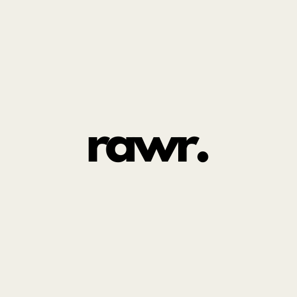

<p align="center">
  
</p>

> A CLI Project for generate rawr projects.

### updates and improvements

The project still in development and the next updates will be the following:

- [ ] create the base args for init a new project
- [ ] set the same template as a base template
- [ ] create tests

## 💻 pre-requisites

Before start, verify if you have the following things:
- you have installed the most recent version of [Clang](https://releases.llvm.org/download.html) or [GCC](https://gcc.gnu.org/install/download.html)
- you have any of `windows`, `macos`, `linux` operating system

## 🚀 installing rawr
To install `rawr` you need to:
- clone repository
```sh
git clone https://github.com/roqueando/rawr.git
```
- build and test
```sh
make build
```

## 😄 be a contributor

Want to be part of contributor? See the [contributing](CONTRIBUTING.md) page for how to contribute.

## 📝 license

This project is under the license. See the file [LICENSE](LICENSE.md) for more details
